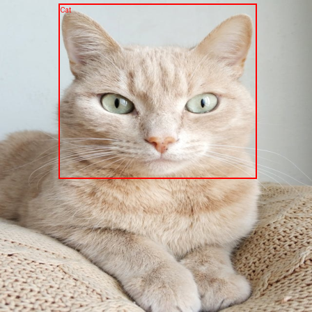
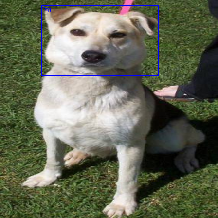

# Cat vs Dog Object Detector (PyTorch)

### Expected output:
<div align="center">
  
  
</div>

A deep learning project that detects **Cats and Dogs in images** and predicts both tasks from a single image:

* **classification** (cat or dog)
* **bounding box localization**

The model combines a **ResNet-18 style backbone**, a **classification head**, and a **bounding box regression head** into a single multi-head network built from scratch using PyTorch, without relying on existing detection frameworks such as YOLO or Detectron2.

This project demonstrates how to build an object detection pipeline from scratch using PyTorch.

* model architecture
* training pipelines
* bounding box regression with CIoU loss
* multi-task learning
* inference and visualization

This repository includes detailed **experiment logs** documenting the training
process, hyperparameter tuning, and model behavior during development.

Pre-trained weights are available [here](https://tinyurl.com/38t2bs6u).

# Performance

The model demonstrates strong generalization, particularly in classification accuracy. 
Bounding box localization benefits significantly from the CIoU loss function.

<table align="center">
  <thead>
    <tr>
      <th>Metric</th>
      <th align="center">Train Set</th>
      <th align="center">Test Set</th>
    </tr>
  </thead>
  <tbody>
    <tr>
      <td><strong>Classifier Accuracy</strong></td>
      <td align="center">~96%</td>
      <td align="center"><strong>94%</strong></td>
    </tr>
    <tr>
      <td><strong>Bounding Box IoU</strong></td>
      <td align="center">~0.86</td>
      <td align="center"><strong>0.74</strong></td>
    </tr>
  </tbody>
</table>

---

# Model Architecture

The detector is composed of three components:

```
Input Image
     │
     ▼
Backbone (ResNet-18 style feature extractor)
     │
     ├──► Classifier Head → logits (cat/dog)
     │
     └──► Localizer Head → bounding box (cx, cy, w, h)
```

### Backbone

ResNet-18 feature extractor trained first using an image classification task.

### Classifier Head

FC network that predicts:

```
Cat or Dog
```

### Localizer Head

Regression network that predicts bounding box coordinates:

```
(cx, cy, width, height)
```

---

# Training Strategy

The training pipeline follows a **progressive learning approach**:

1. Train backbone with classifier on classification task
2. Train localization head with frozen backbone
3. Gradually unfreeze backbone layers for fine-tuning
4. Train full detector jointly

Loss function combines:

```
Total Loss =
    Localization Loss (CIoU) * 1.0
    +
    Classification Loss (CrossEntropy) * 0.5
```

Bounding box regression uses **Complete IoU (CIoU)**.

## Backbone Freezing Strategy

During the localization stage, the backbone is initially **fully frozen** so that the localizer head can learn bounding box regression without modifying the pretrained feature extractor.

Example:

```python
backbone.eval()

for param in backbone.parameters():
    param.requires_grad = False
```

---
# Dataset Preparation

Dataset split:

```
Total samples : 3612

Cats: 1167 ~ 32.23% | Dogs: 2445 ~ 67.76%

Ratio: 1:2.09 | cat : dog

Test dataset = 708/3612 ~ 20%
  * Cats: 230
  * Dogs: 478
  * Ratio: 1:2.08


Train dataset = 2904/3612 ~ 80%
  * Cats: 937
  * Dogs: 1967
  * Ratio: 1:2.09

```

Bounding boxes are stored in YOLO **(cx, cy, w, h)** format.


During dataset inspection and visualization, several problematic samples were identified and removed to improve training quality.

Issues found in the raw dataset included:

* images containing **multiple animals** (e.g., two dogs or two cats)
* images containing **both a cat and a dog**
* images containing **humans or unrelated objects**
* images with **significant noise or poor labeling**

Since the model is designed for **single-object detection per image**, these samples were removed during preprocessing.

Cleaning the dataset helps prevent incorrect supervision during training and improves both classification accuracy and bounding box regression.

Imbalanced datasets can negatively impact classification models.  
More information about this concept can be found [here](https://www.geeksforgeeks.org/machine-learning/what-is-imbalanced-dataset/).

---


# Installation

Clone the repository:

```
git clone https://github.com/MaherovskyiDenys/cat-vs-dog-detector.git
cd cat-vs-dog-detector
```

Install dependencies:

```
pip install -r requirements.txt
```

---

# How to Train the Model


### Step 1 — Train Classifier

Train the backbone and classifier:

```
python network/classifier/train.py
```

Training outputs:

* training metrics
* evaluation metrics
* training plots

Example of training plots:


This will save pre-trained backbone and classifier into **weights/** folder

### Step 2 — Train Localizer

Train the localization head using the pretrained backbone:

```
python network/localizer/train.py
```

Training outputs:

* training metrics
* evaluation metrics
* training plots

Example of training plots:


This will save fine-tuned backbone parameters and localizer into **weights/** folder

### Step 3 — Train Full Detector

Train the model:

```
python network/train.py
```

Training outputs:

* training metrics
* evaluation metrics
* training plots

Example of training plots:


This will fine-tune pre-trained **heads and backbone** and save model into **weights/** folder as **catvsdogdetector.pt**

---

# Inference

Run inference on a single image:

```
python -m network.evaluate weights/catvsdogdetector.pt test/images/image.jpg output/
```

Arguments:

```
model   Path to trained .pt model
image   Path to input image
output  Output directory
```

The script will save a **PNG image with predicted bounding box and label** into given directory.

---
# Training Logs
Detailed training experiments and observations are documented in the following files.

These logs include:
* hyperparameter choices
* training curves
* model behavior observations
* experiment notes and conclusions

Feel free to explore them to better understand the training process and model improvements.

- **Classifier** → [View logs](network/classifier/logs.md)
- **Localizer** → [View logs](network/localizer/logs.md)
- **Full Detector** → [View logs](network/logs.md)

## Training Notes

### Loss Design

An **L1 regression loss** was initially considered for bounding box prediction but was later removed.

This is because **CIoU already incorporates**:

- overlap quality
- center distance
- aspect ratio consistency

Adding L1 loss did not significantly improve performance and unnecessarily complicated the loss function.

---


# Technologies Used

* Python
* PyTorch
* WebDataset
* TorchVision
* Matplotlib

---

# Learning Goals

This project was built to understand:

* convolutional neural networks
* object detection fundamentals
* multi-head learning
* bounding box regression
* PyTorch training pipelines

---

# Future Improvements

Possible extensions:

* multi-object detection
* anchor-based detection
* YOLO-style architecture
* larger datasets
* model deployment API

---
# License

[MIT License](LICENSE.md)

---
# Author

Denys Maherovskyi

[LinkedIn](https://www.linkedin.com/in/denys-maherovskyi-b59004398/) | [GitHub](https://github.com/MaherovskyiDenys)
